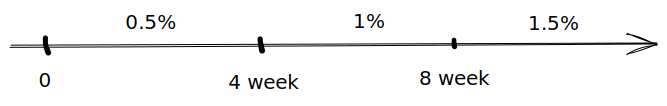

# 8.3 设备采购合同履行管理

## 1 合同价格与支付

### （1）合同价格

* 应包括一切成本、费用、合理利润
* 一般为固定价格

### (2) 价款支付

* 预付款：28天内支付10%，履约则抵价款
* 交货款：收到单据28天内，支付至60%
  * 卖方出具交货清单正本
  * 买方签署交货清单正本
  * 制造商出具质量合格证
  * 增值税发票
* 验收款：验收证书或进度款支付函28天内，支付25%
* 结清款：质保期结束后，买方签署证书，28天内支付剩余5%

## 2 监造和交货前检验

* 监造
  * 买方监造提前7天通知
* 交货前检验
  * 费用由卖方承担，买方费用也不报销
  * 7天前通知买方，不来就不来
  * 不视为对质量的最终确认

## 3 包装、标记、运输和交付

与材料合同要求相同

## 4 开箱检验、安装、调试、考核、验收

* 开箱检验
  * 时间可在交付时或之后，提前3天通知
  * 应在施工场地，双方共同进行
  * 结果不对抗后续质量问题
* 安装调试
  * 根据专用条款决定谁负责安装
  * 水电费由买方承担
* 考核
  * 最多3次，卖方原因均不通过，买方可以解除合同
  * 买方原因不通过，则再次安排，也是最多3次
* 验收
  * 考核合格，7日内签署支付函
  * 买方原因3次不通过，7日内签署支付函，12个月内提供相关服务，买方承担费用
  * 最后一批交付后6个月不考核，视为合格

## 5 技术服务

* 技术人员的交通食宿卖方承担，工作条件买方承担
* 技术人员不合格可要求撤换，费用卖方承担

## 6 违约责任

### (1) 卖方迟延交货

* 第1\~4周，每周设备价格0.5%
* 第5\~8周，每周设备价格1%
* 第9周以后，每周设备价格1.5%
* 总额不超过合同价10%

### (2) 买方延迟付款

同上，基数改成迟延付款金额

