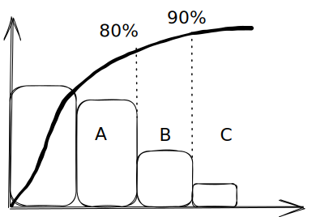

# 3.1 工程质量统计分析

## 1 基本原理和方法

### (1) 质量数据分布特征

* 质量数据的特性
  * 个体数值的波动性
  * 总体分布的规律性
* 波动的原因
  * 偶然性原因
  * 系统性原因
* 规律性：一般为正态分布

### (2) 抽样检验与检验批

* 必须抽样检验的情形
  * 破坏性试验
  * 全数检验太贵、太耗时
  * 全数检验也不能保证100%合格
* 检验批：提供检验的一批产品
  * 质量不太稳定，以小批量为宜

### (3) 抽样方法

* 简单随机抽样
* 系统随机抽样
* 分层随机抽样
* 多阶段抽样

### (4) 抽样检验的分类与方案

* 计量型检验：连续型变量
* 计数型检验：离散型变量
  * 一次抽样检验
  * 二次抽样检验
  * 多次抽样检验
* 抽样检验风险
  * 第一类风险：弃真，把合格的弄成了不合格的
  * 第二类风险：存伪，把不合格的弄成了合格的

## 2 工程质量统计分析方法

### (1) 调查表法

* 分项工程作业质量分布调查表
* 不合格项目调查表
* 不合格原因调查表
* 施工质量检查评定用调查表

### (2) 分层法

* 按操作者/班组分层
* 按机械设备型号分层
* 按操作方法分层
* 按供应商/供应时间/登记分层
* 按施工时间分层
* 按检查手段、工作环境分层

### (3) 排列图法

* 排列图=频数分布直方图+累计频率图（按频度降序排列）
* ABC分类法
  * A类：0\~80%，主要因素
  * B类：80%\~90%，次要因素
  * C类：90%\~100%，一般因素

### (4) 因果分析图法

### (5) 直方图法

* 折齿形：组数或组距不当
* 左/右缓坡型：对上限/下限控制太严
* 孤岛型：原材料发生变化、他人临时顶班
* 双峰型：两组不同数据混在一起
* 绝壁性：有意识去掉阈值数据

### (6) 控制图法

* 正常
  * 连续25点落在界限内
  * 连续35点超限1点
  * 连续100点超限2点
* 异常
  * 链：连续出现在中心线一侧，5点关注，6点调查，7点处理
  * 多次同侧：连续11点10次、14点12次、17点14次、20点16次
  * 趋势/倾向：连续7点上升或下降
  * 周期性变动
  * 接近控制界限：2\~3个标准差，3点2次、7点3次、10点4次

### (7) 相关图法

即散点图，能看出相关系数
