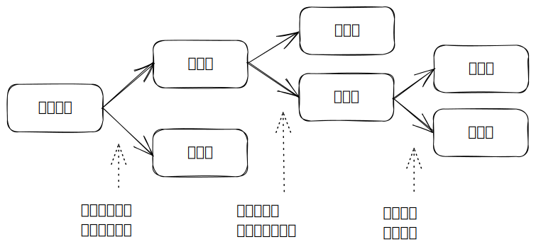

# 2.1 基本概念

## 1 流水施工方式

### (1) 组织施工的方式

| 组织方式 | 特点                                                                                           |
| ---- | -------------------------------------------------------------------------------------------- |
| 依次施工 | <ul><li>工期长</li><li>各专业队不能连续作业</li><li>不能实现专业化施工</li><li>利于资源供应组织</li><li>组织管理比较简单</li></ul> |
| 平行施工 | <ul><li>工期短</li><li>资源无法均衡使用</li><li>不能实现专业化施工</li><li>不利于资源啊供应组织</li><li>组织管理比较复杂</li></ul> |
| 流水施工 | <ul><li>工期比较短</li><li>实现专业化施工</li><li>专业队能连续作业</li><li>资源量比较均衡</li><li>利于文明施工、科学管理</li></ul> |

### (2) 流水施工的表达方式

| 表示法 | 表达方式     | 优点        |
| --- | -------- | --------- |
| 横道图 | 按施工过程列示  | 绘图简单，使用方便 |
| 垂直图 | 按施工段编号列示 | 斜率表示进展速度  |

## 2 流水施工参数

### (1) 工艺参数

* **施工过程(n)**：将计划任务划分的子项
  * 分类
    * **建造类**施工过程
    * **运输类**施工过程
    * **制备类**施工过程
  * 细度
    * 控制性进度计划：单位工程、分部工程
    * 实施性进度计划：分项工程
* **流水强度**：某施工过程单位时间内完成的工程量

### (2) 空间参数

* **工作面**：供某专业工人或机械施工的活动空间
* **施工段(m)**：将施工对象在空间上分成若干施工段落
  * 目的：组织流水施工
  * 原则
    * 同一专业队在个施工段的劳动量相近
    * 每个施工段有足够的工作面
    * 界限与结构界限尽可能吻合
    * 满足合理组织流水施工的要求
    * 多层建筑物还需要分施工层

### (3) 时间参数

* **流水节拍(t)**：某专业队在一个施工段上的施工时间
  * 确定方法：定额计算法、经验估算法
* **流水步距(K)**：相邻两个施工过程相继开始施工的最小间隔时间
  * 各施工过程保持工艺先后顺序
  * 各专业队连续作业
  * 相邻施工过程最大限度合理搭接
* **流水施工工期**：从第一个专业队开始，到最后一个专业队结束

## 3 流水施工的基本组织方式

* 有节奏流水施工：每个施工过程的流水节拍不变
  * 等节奏流水施工：各施工过程的流水节拍都相等
  * 异节奏流水施工：各施工过程的流水节拍不相等
    * 等步距：按流水节拍倍数关系安排专业队数量
    * 异步距：不按倍数关系，每个施工过程一个专业队
* 非节奏流水施工：每个施工过程的流水节拍会变

